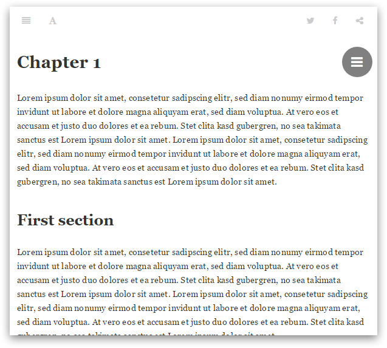
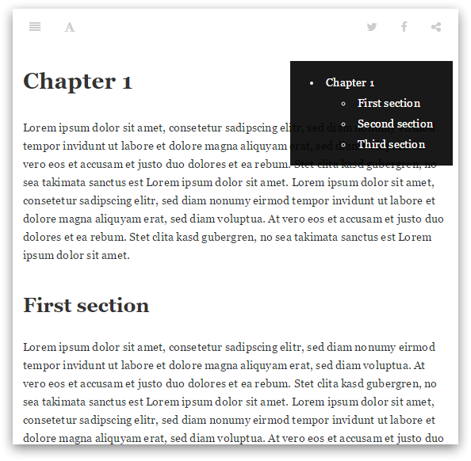

# Honkit Page TOC Button Plugin

This plugin adds a table of content (TOC) button to your GitBook page. All three GitBook themes (White, Sepia, Night) are supported. This project took heavy inspiration from https://plugins.gitbook.com/plugin/anchor-navigation.

## Fork of gitbook-plugin-page-toc-button

honkit-plugin-back-to-top is a fork of https://github.com/stuebersystems/gitbook-plugin-back-to-top-button

This plugin has a feature to customize icon to display.

## Usage

### Installation

Add the plugin to your `book.json`:

```js
{
	"plugins" : [ "page-toc-button" ]
}		
```

### Optional configuration

You can add the following configuration params to your `book.json`:

```js
{
	"plugins" : [ 
		"page-toc-button" 
	],
	"pluginsConfig": {
		"page-toc-button": {
			"maxTocDepth": 2,
			"minTocSize": 2,
            "icon": "<i class='fas fa-ellipsis-h'></i>"  
   		}
	}
}			
```

Name        | Type    | Default | Description 
----------- | ------- | ------- | ------------
maxTocDepth | Number  |       2 | Maximal depth of headers (2 = h1 + h2 + h3). A value > 2 is not supported.
minTocSize  | Number  |       2 | Minimal number of toc entries for showing the toc button.
icon        | String  |<code>&lt;i class='fa fa-bars'&gt;&lt;/i&gt; | Icon charcter of FontAwesome 4 (Above configuration needs FontAwesome 5)

## Screenshots

The page toc button:



The page toc menu:


